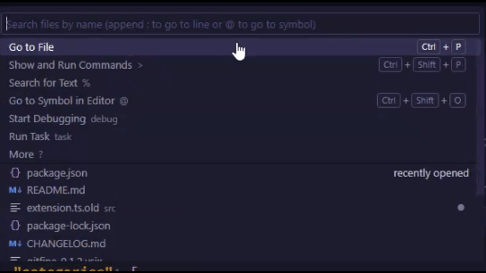

# GitFine

GitFine is a Visual Studio Code extension that allows you to check your repo stats and more from your code editor.

## Features
- Displays the number of stars, forks, and open issues on your repository.

*More features will be coming soon.*

## Installation

1. [Download the extension](https://marketplace.visualstudio.com/items?itemName=DeclanCruise.gitfine)
2. Go to your [GitHub settings](https://github.com/settings/tokens).
3. Click **Generate new token**.
4. Select the `public_repo` scope.
5. Generate the token and copy it.
6. When prompted by the extension, paste your token.

> **WARNING:** Do not paste or use this token anywhere else as it can result in safety problems.

> **Note:** Your token is saved in the VSCode settings for future use.

*0.1.4*
*Initial release of GitFine 0.1.4.*
